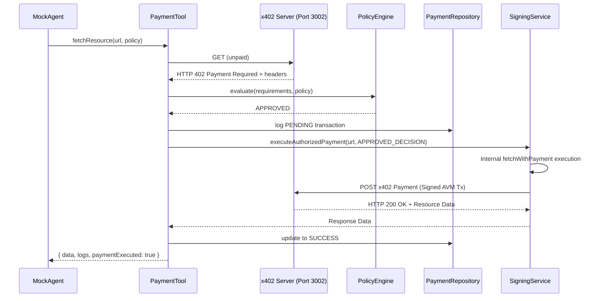

# Phase 3: AI Agent Payment Capability

## Overview

In Phase 3, we successfully transformed the standalone x402 payment flow into a robust, policy-driven AI Agent payment capability. This enables an AI agent to automatically call paid APIs (returning HTTP 402) while strictly adhering to user-defined spending limits, approved assets, and network restrictions.

## Architecture

The architecture maintains strict security boundaries to ensure the AI Agent cannot bypass the deterministic Policy Engine or access sensitive credentials directly.



## Security Boundaries

1.  **Isolated Credentials:** The `SigningService` is the only component that accesses `X402_CLIENT_MNEMONIC`. The raw mnemonic and signer instances are never exposed to the AI Agent or the `PaymentTool`.
2.  **Deterministic Authorization:** The `SigningService.executeAuthorizedPayment` method explicitly requires a `PolicyDecision` object with an `APPROVED` status. It acts as a strict boundary; if an agent attempts to bypass the policy engine, the signing service rejects the request.
3.  **Encapsulated Client:** The reusable logic from Phase 2 was extracted into `@agentflow/x402-client`, standardizing the parsing of 402 headers and the initialization of the `x402Client` SDK across the monorepo.

## Component Implementation

### `@agentflow/x402-client` (SDK Package)
A new local workspace package was created to share payment logic without duplicating code or exposing `dotenv` dependencies. It exports pure functions like `createAvmPayingClient` and `readPaymentRequired`.

### `PaymentHistory` (Database Layer)
A JSON-backed repository (`apps/api/src/db/PaymentHistory.ts`) that implements the `PaymentRepository` interface. It stores all transactions (PENDING, SUCCESS, FAILED) to track daily spend limits and maintain audit trails.

### `PolicyEngine` (Deterministic Policy)
Evaluates `PaymentRequiredSummary` against a `UserSpendingPolicy`.
- Validates network (`allowedNetworks`)
- Validates asset ID (`allowedAssets`)
- Checks transaction limits (`maxPerTransaction`)
- Aggregates historical spend for daily limits (`dailyLimit`)
- Enforces manual approval thresholds (`requireApprovalAbove`)

### `PaymentTool` (Agent Action)
The orchestrator tool designed to be invoked by the LLM when interacting with resources. It encapsulates the full 402 retry flow: unpaid request -> requirement extraction -> policy evaluation -> DB logging -> authorized execution -> response returning.

## API Usage Example

```typescript
// Define policy
const policy = {
  maxPerTransaction: 100000, // 0.1 USDC (base units)
  dailyLimit: 500000,        // 0.5 USDC (base units)
  allowedAssets: [10458941], // TestNet USDC
  allowedNetworks: ['algorand:SGO1GKSzyE7IEPItTxCByw9x8FmnrCDexi9/cOUJOiI='],
  requireApprovalAbove: 50000 // 0.05 USDC
};

// Agent invokes tool
const fetchResult = await paymentTool.fetchResource(
  'http://localhost:3002/research/insight',
  policy,
  'Fetch high-value research data'
);
```

## Testing & Verification

A comprehensive unit testing suite using `vitest` was implemented in `apps/api/src/agent` and `apps/api/src/security`:
- `PolicyEngine.test.ts`: Verifies rejection of excessive amounts, unsupported assets, and invalid networks.
- `PaymentTool.test.ts`: Verifies successful DB logging, policy execution, and handling of both approvals and denials.
- `SigningService.test.ts`: Confirms that `mnemonic`/`signer` cannot be read externally, and unapproved transactions are strictly blocked.

### End-to-End Test Results

The full end-to-end integration was verified by executing the `MockAgent` against the live local x402 resource server (`http://localhost:3002/research/insight`) via the `/api/v1/agent/procure` endpoint.

**Case 1: Policy Approved**
- **Trigger:** Request with policy `maxTransaction: 1 USDC`
- **Result:** `APPROVED`. Agent extracted 402 requirements (0.01 USDC), signed the transaction securely, and received the unlocked resource.

**Case 2: Max Transaction Denied**
- **Trigger:** Request with policy `maxTransaction: 0.005 USDC`
- **Result:** `DENIED`. Agent aborted. Log: `Payment was DENIED. Reason: Amount 10000 exceeds max per transaction limit of 5000`.

**Case 3: Network Denied**
- **Trigger:** Request with policy `allowedNetworks: ['algorand:mainnet']`
- **Result:** `DENIED`. Agent aborted. Log: `Payment was DENIED. Reason: Network algorand:testnet is not allowed by policy`.

### Live Algorand TestNet Transaction Proof
The Case 1 test executed a real transaction on the Algorand TestNet using the `x402` SDK.
- **Transaction ID:** `JRBRGU6BM4U2MOQRZQCLMJRYYIUE4G236OHGJFJ5LBZPHI5FLHDQ`
- **Asset ID:** `10458941` (TestNet USDC)
- **Amount:** `0.01 USDC`
- **PayTo Address:** `DZDDQQEQWX7EQCVV2YSC5BULDMG5Q3SGVKDTEWV7Z7W5GCGZQUQRK2YLBQ`
- **Network:** Algorand TestNet
- **x402 Scheme:** `ExactAvmScheme`
- **Final Agent Response:** `AgentFlow TestNet paid resource successfully unlocked.`

## Future Enhancements

- **PostgreSQL Migration:** Move `PaymentHistory` from a JSON file to a relational database for concurrent transaction safety.
- **Dynamic PayTo Extraction:** Currently, the `payTo` address is mocked in the DB layer; it should be fully extracted from the 402 header.
- **Manual Approval Flow:** Implement a WebSockets or polling mechanism to suspend the agent run when a payment requires user approval (`REQUIRES_APPROVAL`), resuming execution after the user signs or confirms the transaction.
- **Smart Contract Policy Enforcement:** Shift the `PolicyEngine` logic into an Algorand Smart Contract (ASC1) so spending limits are enforced on-chain rather than just in the application layer.
